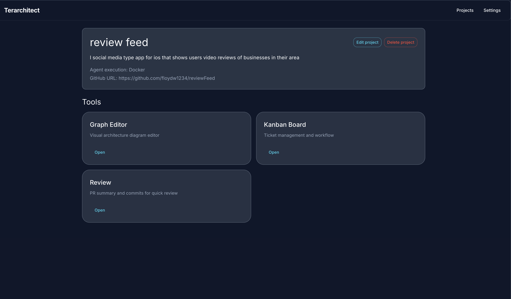
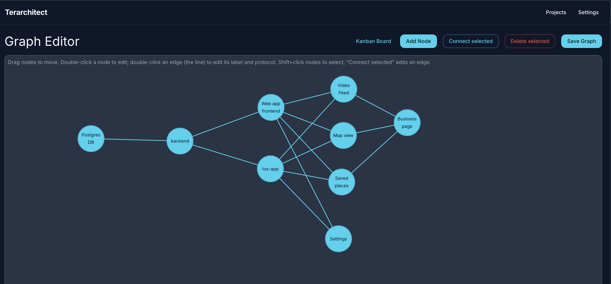
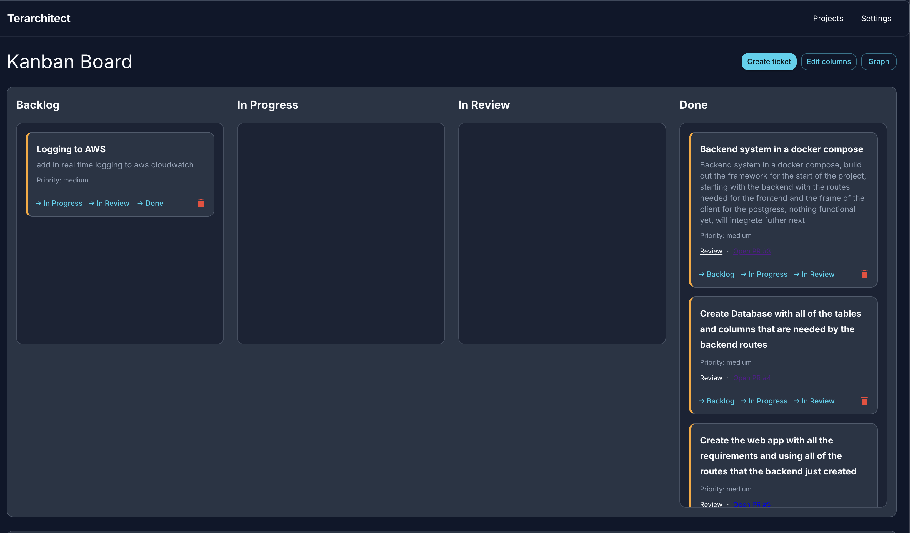
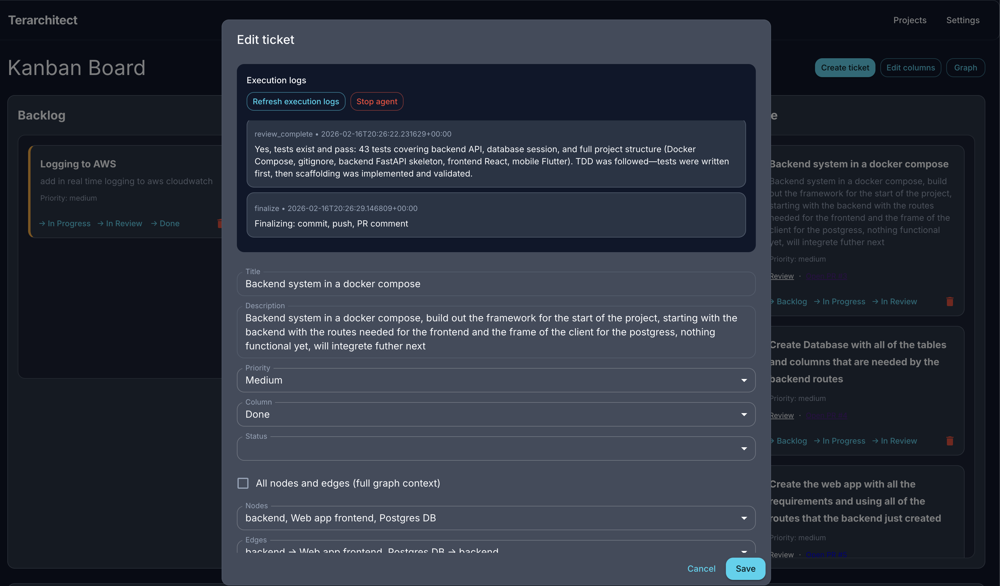

# Terarchitect

Terarchitect is a visual-first SDLC orchestrator: model your system as a graph, write tickets on a Kanban board, and let a **Director → Worker** agent pair implement changes in your repo and open PRs.

- **You stay in control**: every change ships as a PR you review.
- **One container per job**: reproducible, isolated runs.
- **Coordinator-friendly**: run the coordinator on the same machine as the app, or on a completely separate machine.

If you’ve ever wanted “Kanban → PRs” with guardrails, this is it.

<p align="center">
  
</p>

## Screenshots

| Architecture graph | Kanban execution |
|---|---|
|  |  |
|  |  |

---

## What you get

- **Architecture graph**: encode components + interfaces, not just TODO lists
- **Kanban-driven execution**: moving a ticket to *In Progress* enqueues an agent job
- **Director/Worker separation**: strategy (Director) vs local execution + tools (Worker — OpenCode or Claude Code)
- **PR-first workflow**: branch per ticket (`ticket-{id}`), PR opened automatically
- **Runs anywhere Docker runs**: single-box dev or two-box production

---

## Technology (what’s under the hood)

- **Backend API**: Python 3.11 + Flask + SQLAlchemy
- **Database**: Postgres (with `pgvector/pgvector` image for vector search support)
- **Frontend**: Node 20 + React (served from Docker Compose)
- **Coordinator**: Python (host process) + `requests`
- **Agent image**: Python runner + **OpenCode** (server mode) + **Claude Code** (headless CLI) + Node 20 (for `npm test` in target repos) + Docker daemon (full DinD — each container has its own isolated daemon)

LLM endpoints are configurable via Settings/env (Director model via `AGENT_LLM_URL`, Worker model via `WORKER_LLM_URL`, etc.). See `backend/README.md` and `docs/RUNBOOK.md`.

---

## Memory system (HippoRAG)

Terarchitect includes a lightweight, file-backed project memory system built on **HippoRAG** (bundled as `backend/hipporag_minimal`). The API exposes locked per-project read/write endpoints:

- `POST /api/projects/<project_id>/memory/index` — body: `{"docs": ["text1", ...]}`
- `POST /api/projects/<project_id>/memory/retrieve` — body: `{"queries": ["q1", ...], "num_to_retrieve": 5}`
- `POST /api/projects/<project_id>/memory/delete` — body: `{"docs": ["exact text to remove", ...]}`

Operational notes:
- Memory is stored under `MEMORY_SAVE_DIR` (default `/tmp/terarchitect`).
- HippoRAG uses your configured LLM + embedding service via HTTP (no heavyweight local ML dependencies in the backend).
- The backend also exposes an OpenAI-compatible embeddings adapter at `POST /v1/embeddings` to forward to the configured embedding service.

Details: `backend/README.md` (Memory section).

---

## Worker modes + API integration

Terarchitect supports two worker backends, selectable via **Settings → Worker → Worker mode**:

| Mode | How it works |
|------|-------------|
| **OpenCode** (default) | The agent entrypoint starts `opencode serve` (HTTP API). The Director sends prompts over HTTP (session create → message turns → summarize every 30 turns). Requires `WORKER_LLM_URL` pointing at an OpenAI-compatible LLM. |
| **Claude Code** | The Director invokes `claude -p "..."` (headless CLI) for each prompt. No LLM URL needed — just set `WORKER_API_KEY` to your Anthropic API key. |

At the app boundary, the coordinator/agent use a small “worker API” surface (Bearer-authenticated when `TERARCHITECT_WORKER_API_KEY` is set):

**Context + logs**
- `GET /api/projects/<project_id>/tickets/<ticket_id>/worker-context` (includes `agent_settings`)
- `POST /api/projects/<project_id>/tickets/<ticket_id>/logs` (append execution logs)
- `POST /api/projects/<project_id>/tickets/<ticket_id>/complete` (mark ticket complete)

**Queue**
- `POST /api/worker/jobs/start` (claim next job)
- `POST /api/worker/jobs/<job_id>/complete`
- `POST /api/worker/jobs/<job_id>/fail`

Details: `docs/PHASE1_WORKER_API.md`.

---

## System architecture (app + coordinator + agent)

| Component | What it does | Where it runs |
|-----------|--------------|---------------|
| **App** | Flask API + Postgres + React frontend. Stores projects/graph/tickets/logs and enqueues jobs. Does **not** execute the agent. | **Docker Compose** (`postgres`, `backend`, `frontend`) |
| **Coordinator** | Claims jobs from the API and starts one agent container per job. | **Host process** (can be a different machine with Docker) |
| **Agent image** | Director + Worker (OpenCode or Claude Code). Clones the project repo, implements the ticket, pushes, opens PR, exits. | **Docker container** started by the coordinator |

High-level flow: **UI → enqueue → coordinator claims → agent container runs → PR created → human reviews**.

---

## Quick start (local dev)

### 1) Start the app (API + DB + UI)

```bash
docker compose up -d
```

- **UI**: `http://localhost:3000`
- **API**: `http://localhost:5010`
- **Postgres**: host port `5433` 

### 2) Build the agent image (once)

```bash
docker build -f Dockerfile.agent -t terarchitect-agent .
```

### 3) Run the coordinator (so tickets actually execute)

The coordinator is not part of docker compose. Run it on any host with Docker.

```bash
pip install -r coordinator/requirements.txt
TERARCHITECT_API_URL=http://localhost:5010 \
PROJECT_ID=<your-project-uuid> \
GITHUB_TOKEN=<token> \
TERARCHITECT_WORKER_API_KEY=<optional-worker-api-key> \
python -m coordinator
```

Tip: set `PYTHONPATH=/path/to/terarchitect` if your environment needs it.

**Concurrency note:** the coordinator defaults to `MAX_CONCURRENT_AGENTS=1` but parallel runs are now safe. Each agent container runs its own isolated Docker daemon (DinD via `--privileged`), so concurrent jobs never conflict on container names, networks, or ports. Increase `MAX_CONCURRENT_AGENTS` to run multiple tickets in parallel; see the TODO section for tuning guidance.

---

## Deployments that scale

### Single-box (dev / small deploy)

- Run the app: `docker compose up -d`
- Run the coordinator on the same host
- Set `TERARCHITECT_API_URL=http://host.docker.internal:5010` so agent containers can reach the app
  - On Linux, the coordinator automatically adds `--add-host=host.docker.internal:host-gateway`

### Two-box (production)

- **Machine A**: app only (docker compose). No coordinator required here.
- **Machine B**: coordinator + Docker. Build the agent image here. Run the coordinator here.
- Set `TERARCHITECT_API_URL=https://machine-a.example.com` (or the public URL of Machine A)

Agent containers only need:
- network access to the app (worker-context, logs, complete/fail)
- network access to GitHub (clone/push/PR)

They do **not** need direct DB access.

Full ops notes (systemd, env, verification): see `docs/RUNBOOK.md`.

---

## How execution works

1. You create a project (with a GitHub repo URL), then add tickets.
2. Moving a ticket to **In Progress** enqueues a job.
3. The coordinator claims the job and runs:
   - `docker run ... -e REPO_URL=... -e TICKET_ID=... terarchitect-agent`
4. Inside the container, the agent:
   - clones your repo
   - creates branch `ticket-{id}`
   - runs Director + Worker (OpenCode or Claude Code) to implement
   - pushes branch and opens a PR
   - exits

No mixing with your project’s Dockerfile. The agent image is built once and reused.

---

## Repo layout

| Path | Role |
|------|------|
| `backend/` | Flask API (served by docker compose). Stores graph/tickets/logs; enqueues jobs only. |
| `frontend/` | React UI (served by docker compose). |
| `coordinator/` | Host-side Python process. Claims jobs and starts agent containers. |
| `agent/` | Director + runner + worker wiring (OpenCode and Claude Code). Packaged into the agent image. |

---

## Docs

- `docs/RUNBOOK.md`: deployments, coordinator env, systemd, verification
- `docs/PHASE1_WORKER_API.md`: worker API contract and behavior

---

## Highlights

- **PR review automation**: the app can poll PRs in review, enqueue “review jobs”, and let the agent address comments.
- **Cancelable runs**: worker-facing cancel flag + polling endpoint so you can stop a run cleanly.
- **Per-project execution mode**: run jobs in Docker (clone in container) or Local (run at a configured host path).
- **Encrypted secrets (optional)**: sensitive settings can be stored encrypted at rest with `TERARCHITECT_SECRET_KEY`.
- **Vector search + safety**: pgvector-backed embeddings with an ORM-safe approach (avoids accidentally selecting vector columns).
- **Operator-friendly debugging**: scripts for requeueing tickets, dumping logs/memory, and smoke-testing OpenCode server/CLI.

---

## TODO / Roadmap

- **Raise `MAX_CONCURRENT_AGENTS`**: DinD is now the default (each agent container runs its own isolated `dockerd` via `--privileged`), so `docker compose` collisions no longer occur. Increase `MAX_CONCURRENT_AGENTS` to run multiple tickets in parallel. Monitor host resource usage (RAM, CPU) and tune accordingly.

---

## Contributing

PRs welcome. Keep changes focused and verifiable (tests where possible). If you’re shipping a behavior change, include a short “why” in the PR description.
